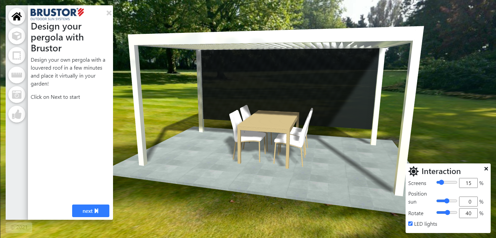
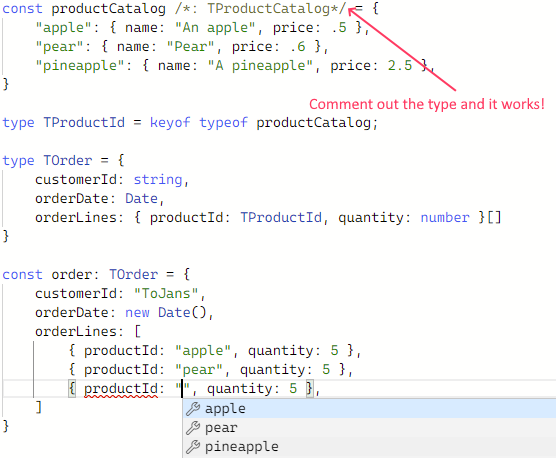
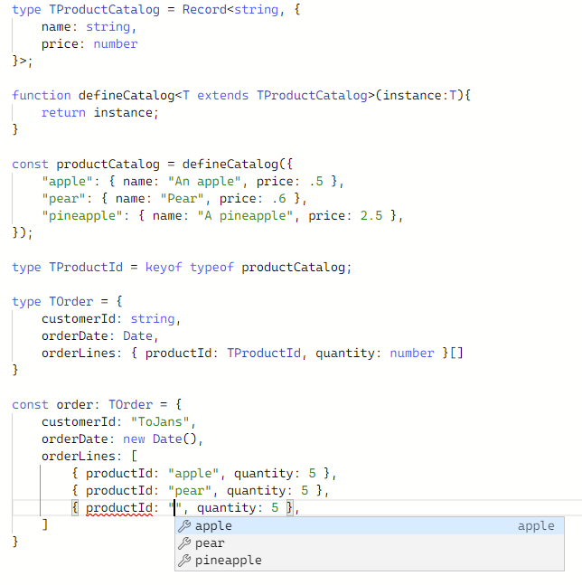

+++
Description = "Reference by value in TypeScript"
date = "2021-03-05T12:00:00+01:00"
slug = "reference-by-value-in-typescript"
title = "Reference by value in TypeScript"
+++

I am currently examining ways to improve development UX for a low-code platform that I'm opening up to the public.

As I started experimenting with TypeScript I tweeted about it. 

<blockquote class="twitter-tweet"><p lang="en" dir="ltr">I constructed a minimal example in the TypeScript playground:<br>- convert a data interface to a template interface<br>- verify references at compile time<br>Try it yourself here:<a href="https://t.co/xLFU3LcB8F">https://t.co/xLFU3LcB8F</a> <a href="https://t.co/SlkHVVOsd6">pic.twitter.com/SlkHVVOsd6</a></p>&mdash; Tom Janssens (@ToJans) <a href="https://twitter.com/ToJans/status/1367490555433910288?ref_src=twsrc%5Etfw">March 4, 2021</a></blockquote> <script async src="https://platform.twitter.com/widgets.js" charset="utf-8"></script>

Because I received quite a lot of inquiries, I decided to blog about it.

This is potentially the first post in a series about leveraging the TypeScript type system to the extreme.

## The context

I am currently extending the [Virtual Sales Lab][1] platform, so we can open it up to external developers.

Virtual Sales Lab is a SaaS that provides online 3D configurators for sales and marketing; below you can see a screenshot from one of our customers' configurator; you can test a copy of the configurator [here][2].



It allows a developer to build something usable in a couple of hours, and a full blown configurator usually takes 1 to 4 weeks.

However, it requires a little bit of effort to get acquinted with the platform as a developer.

As the intent is to make this platform open to all developers as a low-code platform with a low barrier to entry, I was wondering if I could make the developer experience extremely user friendly.

I am a strong believer of leveraging existing tools as much as possible, so I started experimenting with TypeScript. It turns out a lot is possible by being creative with the type system.

## My first experiment: referential integrity.

Our platform takes in a strongly-typed JSON file and converts it into an online 3D configurator like the one I mentioned above.

As the JSON is type-checked, you cannot provide an absolute bogus representation, but bugs are still possible. 

Here is an example of a potential bug:

```TypeScript
    "doorpanel": {
        "elementType": "panel",
        "baseMaterialId": "wood ",
        "width": 100,
        "height": 100,
        "opts": {
            "thickness": 2
        }
    }
```

Did you spot the problem? Instead of `"wood"`, I accidentily typed `"wood "`.

Luckily it raises a proper error at runtime, which allows you to fix the problem, but it does require a round-trip to the engine.

As short feedback loops are the bee's knees, I wondered if there was a way to catch this at compile-time....

## Basics first: whatever happened to TypeScript?

As my TypeScript was a bit rusty - I was mostly [consulting][4] over the past few years -, this was like a TypeScript-101 experience for me, so let's start with the basics... 

Let's say we have 2 simple types: a `TProductCatalog` and a `TOrder` type. How would we represent these?

```ts
type TProductCatalog = Record<string, {
    name: string,
    price: number
}>;

type TOrder = {
    customerId: string,
    orderDate: Date,
    orderLines: { productId: string, quantity: number }[]
}
```

This would allow you to define the following constants:

```ts
const productCatalog: TProductCatalog = {
    "apple": { name: "An apple", price: .5 },
    "pear": { name: "Pear", price: .6 },
    "pineapple": { name: "A pineapple - or Ananananananas as they say in Dutch", price: 2.5 },
}

const order: TOrder = {
    customerId: "ToJans",
    orderDate: new Date(),
    orderLines: [
        { productId: "apple", quantity: 5 },
        { productId: "pear", quantity: 5 },
        { productId: "pine-apple", quantity: 5 },
    ]
}
```

> You can [try adjusting the order or productcatalog yourself here][3]. 
> Please note you have auto-complete on the field members automatically; thank you TypeScript!

But, did you spot the error?

Yes, the dreaded reference-by-id: not `"pine-apple"`, but `"pineapple"`.

## The `keyof` keyword to the rescue!

It took some digging, but this was one of the easier finds: I only had to figure out the correct keyword: `keyof`.

```ts
const productCatalog: TProductCatalog = {
    "apple": { name: "An apple", price: .5 },
    "pear": { name: "Pear", price: .6 },
    "pineapple": { name: "A pineapple - or Ananananananas as they say in Dutch", price: 2.5 },
}

type TProductId = keyof typeof productCatalog;

type TOrder = {
    customerId: string,
    orderDate: Date,
    orderLines: { productId: TProductId, quantity: number }[]
}

const order: TOrder = {
    customerId: "ToJans",
    orderDate: new Date(),
    orderLines: [
        { productId: "apple", quantity: 5 },
        { productId: "pear", quantity: 5 },
        { productId: "pine-apple", quantity: 5 },
    ]
} 

```

However, the type for `TProductId` was a `string`...

## Why was `TProductId` a `string` and not an `"apple"|"pear"|"pineapple"`

At first I was puzzled, but then it hit me... This makes sense because we literally declare the type of `productCatalog` as a `Record<string,...>`. which is the type parameter we pass to the `keyof` ... 

Hello Captain Obvious!

So I tried removing the typing from the const, and I was thrilled!



> Try it yourself in the [Playground Link][5]

 So how can we avoid this?
So autocomplete/referential integrity works, but we cannot have types?

## Helper functions to the rescue!

This took some digging, and apparently there is a simple workaround: use a helper function:

```ts
function defineCatalog<T extends TProductCatalog>(instance:T){
    return instance;
}
```

This function takes in an instance of any type `T`, as long as `T` implements the `TProductCatalog`...

And voila, you have reference-by-value at compile time.



>Try it yourself in [this playground][6]

## In closing

There you have it; referential integrity checking at compile-time. While this is not exactly rocket-science, it required a little bit out-of-the-box thinking.

While I might use the type system beyond it's initial intent, I think this will provide a lot of value the well well-constrained low-code platform we are building for Virtual Sales Lab.

Please note that this is still a little bit rough around the edges, especially as you start creating dependencies on other types. 

I hope this was an interesting read; if I receive a lot of feedback on this I will probably write more posts about this,so let me know!


[1]: https://www.virtualsaleslab.com/?lang=en
[2]: https://productconfigurator.virtualsaleslab.com/r/vsl/vsl/en/designer/index/patioroof3
[3]: https://www.TypeScriptlang.org/play?#code/PTAEBkFMBcHIGdTwIYE9QHdKgBbIG7YBMSAlgLYAOANttKpZPAFwBQr9joAKgAoBOAewAmAVwDG0AMLJoyaoIDmoALygASpHGD+wgDzxo-UgDtFAGlABvVqDugTycpGZIjpi7fuVj4lw9FyACNIflYAXwA+AG52TmxuAHldUNVrLztxUUNBZ34ASWFXQ2MzcwzQHWFQgBFZfzroSHL7SpT+cFMmVytQHxEJaELi9zLQAEdRZBNoUnpXE0CQ-lBwgG0AXQj2EB4cUkQMQVFqYVB5BQxQVGPQaEFQaoAzLrucbCfBakuPUG0TQzTaAsdj-Qx9IRiSQyOQKRSuPiQwYw+RKNI2VoAImQlBokExPQcTn8mIAgiZzrjaJjLD5SH5XAA6ACsqxa9kxjGQ-AJ1iJzlcmN4kG5NIh9P8jIAbGyKpyuji8bzeo4BaAyX0FVTsABaNqgcnTI2OE3IRBmt6QdAodCmUA1UTQcQ4MV0hmgIgs2XhUGCAHQNrVfgI5JB9EVLI5PLDdXcQQAKWm8BpFSqtXqC0gV0akAAFABKdl2NMdLosUBrCqtXr9KFDIrqxXUyyTIFzVCuVnhIutPm1wYxzkinktqYzdud2W9+w1pGSQeULo6pv40dt+agLs9rbhUBAA
[4]: /services/
[5]: https://www.TypeScriptlang.org/play?#code/C4TwDgpgBAKgCgJwPYBMCuBjYBhAhsXAGyQHMoBeKAJQgyQRQB4BnYBASwDsSAaKAbwBQUEVE64AthABcUVh249hosBwwyxaCQCMICQQF8AfAG5BggPQXqECUgBu0YAAtoAA3jJ0WPAWIk3KFBIOXYScWA0BCckKGdcRyg6CTB2Qid2KUtraIAzPQhOYHYiKC5gCBIOUCTXDABrZigkTiDXKDd6FD0AGS4IZjdzOk5WKFVUTBx8IlIoWU9Jnxn-CgFlEQAiXDAwdM3ZfjFJDU2AQVadvYhNvlV2dVkAOgBWKAMlUShNyFwEA4Exyksk2cAgf1u4zUGieADZ3p9RD9+ld9ocgaczuMUbt9ndobIAEyvBGGczBaCLbzAACSKDW9QgICQuSC4AgLKhS2mflIZkEFNgAHkGHo1kIvhg0KwkFIEHTZPIuLwNs1RQgACL4DRaiqIkRdXr9ZjoibUhWwRDcul8ACOaFwRXYoFknC0ugQ7wA2gBdMmCEZjQ0IBYi7qeygS0RSmVyi2bGBIABSjuYt1Vwd1Gk4EAA7lAswAKACU+rV4b6OZNUC9qq+RzNU3jqJudodTpdUDeHzrogbXibKBBv3+bcdxU73bL9a55qH31SOYAtC3Ifbx86QLIp6q-QYoOYgA

[6]: https://www.TypeScriptlang.org/play?#code/C4TwDgpgBAKgCgJwPYBMCuBjYBhAhsXAGyQHMoBeKAJQgyQRQB4BnYBASwDsSAaKAbwBQUEVE64AthABcUVh249hosBwwyxaCQCMICQQF8AfAG5BggGZpOWdkk5QUEC1wh4CxEoxhQIAD2AIThRmWERUTBx8IlIjAAouVlwbGRgASiFRKAQIYDQEB0SCFLMDczpOVihVCKx3GLJKJxdON2jPOMzRACJcMDBCCG7ZfjFJDW6AQQc+gaG+VXZ1WQA6AFYoAyUs7shcBGGBMalZbrgIfe6FtQ0VgDZN7Z6wV1nBw9HxE6gp6tf+97XJYaABM60ehjSZkEoEgYWQ6CwAEkUBQoABrCAgJAWKCwiA46oIyL1TzQ-GwADyDD0aK6IgwaFYSCkCBRsnkXF4yhE9CcCAAIvgNELAk9eTSEAAZVzMEZE2rAdnwxUovgARzQyWA7FAsk4Wl0CE2AG0ALqGcr2Kp8vSyGDU-l0nlQRnM1nK7owJAAKWSzCuLttguF+ogAHcoKKIHE0uKoMGZa05VATS6sqMaoilShTm95lBNdrdSBZBstunRJnicjcz89gcNVrODq9VBy-GMwrs56roXm63S+2IVkLQYoOYgA


<script type="text/javascript">
    // fix error in TypeScript syntax highlighting
    window.addEventListener("load",function(){
        [].forEach.call(document.querySelectorAll(".language-ts .err"),function(el){
            console.log(el.textContent);
            if (el.textContent == "," || el.textContent == ":") {
                el.classList.remove("err")
            }
        });
    })
</script>

